<div align="center">


<h1>Government Landing Zone</h1>

<p><strong>The Institutional-Grade Platform for Sovereign Cloud Foundations, Public Sector Data Protection, and FedRAMP-Aligned Mission Orchestration.</strong></p>

[]()
[]()
[]()

<br/>

> **"Industrializing public sector cloud to secure sovereign data."** 
> **Government Landing Zone** is an enterprise-grade platform designed to provide a secure, measurable, and highly automated foundation for global sovereign operations. It orchestrates the complex lifecycle of government infrastructure—from multi-agency tenant provisioning and sovereign boundary enforcement to distributed mission guardrails and unified sovereign auditing.

</div>

---

## 🏛️ Executive Summary

Fragmented agency silos and manual tenant provisioning are strategic operational liabilities; lack of centralized government orchestration is a primary barrier to organizational sovereign maturity. Organizations fail to maintain a secure sovereign foundation not because of a lack of tenants, but because of fragmented landing zone standards, lack of automated boundary validation, and an inability to orchestrate government landing zones with operational precision.

This platform provides the **Government Intelligence Plane**. It implements a complete **Enterprise Government-Landing-Zone-as-Code Framework**, enabling Ministry and Agency teams to manage global sovereign foundations as first-class citizens. By automating the identification of boundary bottlenecks through real-time telemetry analysis and orchestrating the deployment of secure mission-driven data pipelines, we ensure that every organizational service—from core national registries to distributed citizen portals—is governed by default, audited for history, and strictly aligned with institutional sovereign frameworks.

---

## 📐 Architecture Storytelling: Principal Reference Models

### 1. Principal Architecture: Global Government Landing Zone & Sovereign Data Intelligence Plane
This diagram illustrates the end-to-end flow from multi-agency tenant ingestion and mission orchestration to sovereign boundary enforcement, security validation, and institutional government auditing.

```mermaid
graph LR
    %% Subgraph Definitions
    subgraph SovereignIngress["Ministry & Agency Ingress"]
        direction TB
        Federal_Agencies["Federal / National Ministries"]
        State_Local_Entities["State / Local / Regional Gov"]
        Classified_Enclaves["Classified & Mission Networks"]
    end

    subgraph IntelligenceEngine["Sovereign Intelligence Hub"]
        direction TB
        API["FastAPI Government Gateway"]
        MissionOrchestrator["Mission Lifecycle & Data Hub"]
        BoundaryGuard_Hub["Sovereign Boundary & Egress Hub"]
        FedRAMP_Validator["NIST & FedRAMP Risk Hub"]
    end

    subgraph OperationsPlane["Distributed Sovereign Fleet"]
        direction TB
        AgencyWorkers["Managed Agency & Resource Provisioners"]
        SovereignGateways["Secure Boundary & VPN Gateways"]
        AuditProxies["Forensic Mission Review Proxies"]
    end

    subgraph OperationsHub["Institutional Sovereign Hub"]
        direction TB
        Scorecard["Sovereign Maturity Scorecard"]
        Analytics["Boundary Flow & Mission Velocity Stats"]
        Audit["Forensic Sovereign Metadata Lake"]
    end

    subgraph DevOps["Government-LZ-as-Code Framework"]
        direction TB
        TF["Terraform Sovereign Modules"]
        DriftBot["Boundary & Config Drift Validator"]
        ChatOps["Sovereign Operations Hub"]
    end

    %% Flow Arrows
    SovereignIngress -->|1. Submit Sovereign Request| API
    API -->|2. Orchestrate Mission| MissionOrchestrator
    MissionOrchestrator -->|3. Apply Boundary Policy| BoundaryGuard_Hub
    BoundaryGuard_Hub -->|4. Assess FedRAMP| FedRAMP_Validator
    
    FedRAMP_Validator -->|5. Execute Provision| OperationsPlane
    OperationsPlane -->|6. Notify Status| ChatOps
    API -->|7. Visualize Health| Scorecard
    
    Scorecard -->|8. Track Maturity| Analytics
    Scorecard -->|9. Record Provision| Audit
    
    TF -->|10. Provision Backbone| IntelligenceEngine
    DriftBot -->|11. Inject Boundary Risk| MissionOrchestrator
    Audit -->|12. Improve Operations| AgencyWorkers

    %% Styling
    classDef ingress fill:#f5f5f5,stroke:#616161,stroke-width:2px;
    classDef intel fill:#e8eaf6,stroke:#1a237e,stroke-width:2px;
    classDef operations fill:#e1f5fe,stroke:#01579b,stroke-width:2px;
    classDef ops fill:#ede7f6,stroke:#311b92,stroke-width:2px;
    classDef devops fill:#e8f5e9,stroke:#1b5e20,stroke-width:2px;

    class SovereignIngress ingress;
    class IntelligenceEngine intel;
    class OperationsPlane operations;
    class OperationsHub ops;
    class DevOps devops;
```

### 2. The Government LZ Lifecycle Flow
The continuous path of a government landing zone from initial provision (agency tenant) and security (FedRAMP/IL5) to active connection (GovCloud), governance (policy), and institutional forensic auditing.

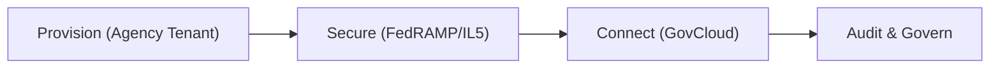

### 3. Distributed Government Landing Zone Topology
Strategically orchestrating sovereign workloads across federal agencies, state/local entities, and air-gapped sovereign clouds, providing a unified institutional view of global sovereign health and LZ readiness.

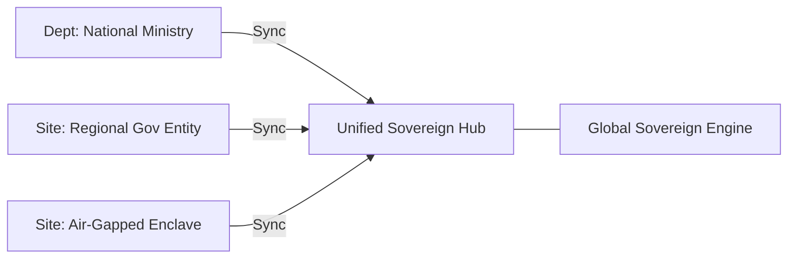

### 4. Sovereign Data Orchestration & Boundary Flow
Executing complex logic for securing the bridge between public internet, government intranets (GovCloud), and restricted enclaves, ensuring every organizational service is discoverable and verified against institutional standards.

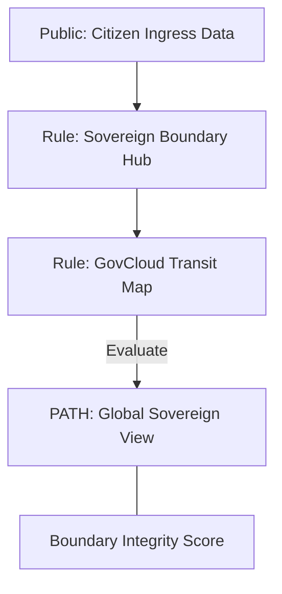

### 5. Multi-Agency Tenant Isolation & Governance Flow
Automatically managing tenant isolation and cross-agency data sharing for global sovereign systems, ensuring institutional data residency and security boundaries by default.

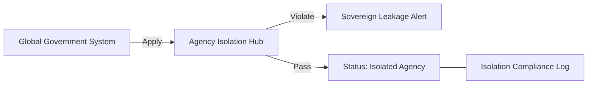

### 6. Encryption & Sovereign Data Protection Flow
Managing the lifecycle of a mission request, automatically enforcing institutional encryption standards for sovereign data at rest and in transit as required by NIST/FedRAMP, ensuring zero-latency security confidence.

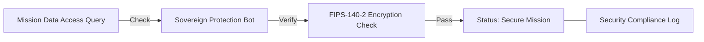

### 7. Institutional Government Maturity Scorecard
Grading organizational performance based on key indicators: Boundary Integrity Grade, FedRAMP Alignment Index, and Mission Response Velocity.

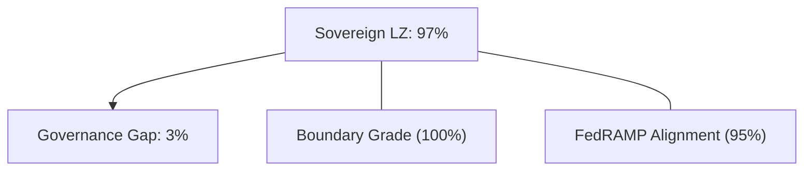

### 8. Identity & RBAC for Sovereign Governance
Managing fine-grained access to sovereign hubs, provisioning workers, and audit logs between Mission Architects, Security Operations (SecOps), and Agency Platform Operators.

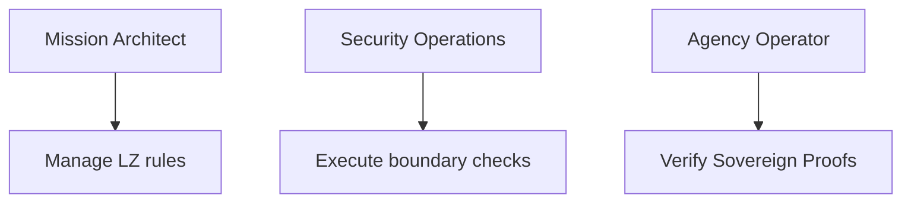

### 9. IaC Deployment: Government-Landing-Zone-as-Code Framework
Using modular Terraform to deploy and manage the versioned distribution of the sovereign tracking hubs, mission guardrail workers, and forensic metadata lakes.

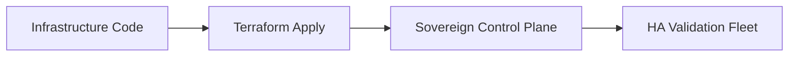

### 10. AIOps Sovereign Drift & Risk Validation Flow
Using advanced analytics to identify sudden surges in boundary violations, unauthorized data egress, suspicious configuration drifts, or unusual mission pattern changes that could result in institutional risk.

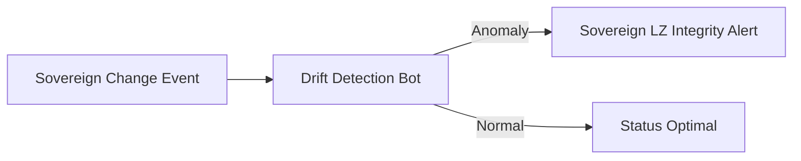

### 11. Metadata Lake for Forensic Government Audit
Storing long-term records of every agency tenant provisioned, every policy change recorded, and every compliance event for institutional record-keeping, compliance auditing, and post-provisioning forensics.

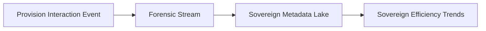

---

## 🏛️ Core Governance Pillars

1.  **Unified Foundation Coordination**: Maximizing resilience by centralizing all sovereign measurement through a single institutional plane.
2.  **Automated Agency Provisioning**: Eliminating "manual tenant" scenarios through proactive orchestration and pattern verification.
3.  **Sequential Mission Intelligence**: Ensuring zero-interruption operations through dependency-aware mission-driven data engineering.
4.  **Zero-Trust Sovereign Protection**: Automatically enforcing identity-based access and rule evaluation across all sovereign tiers.
5.  **Autonomous Operations Logic**: Guaranteeing reliability through automated industry-specific sovereign monitoring runbooks.
6.  **Full Sovereign Auditability**: Immutable recording of every policy change and agency provision for institutional forensics.

---

## 🛠️ Technical Stack & Implementation

### Sovereign Engine & APIs
*   **Framework**: Python 3.11+ / FastAPI.
*   **Mission Engine**: Custom Python-based logic for multi-cloud sovereign provisioning and DORA-style mission metrics.
*   **Integrations**: Native connectors for NIST/FedRAMP Guidance, Azure Government, AWS GovCloud, and GCP Assured Workloads.
*   **Persistence**: PostgreSQL (Sovereign Ledger) and Redis (Live Sovereign State).
*   **Auth Orchestrator**: Federated OIDC/SAML for least-privilege sovereign management access.

### Governance Dashboard (UI)
*   **Framework**: React 18 / Vite.
*   **Theme**: Dark, Blue, Slate (Modern high-fidelity sovereign aesthetic).
*   **Visualization**: D3.js for sovereign topologies and Recharts for mission velocity analytics.

### Infrastructure & DevOps
*   **Runtime**: AWS EKS or Azure Kubernetes Service (AKS) for management plane.
*   **Sovereign Hub**: Managed event sourcing for immutable sovereign security timeline reconstruction.
*   **IaC**: Modular Terraform for deploying the government landing zone and validation fleet.

---

## 🏗️ IaC Mapping (Module Structure)

| Module | Purpose | Real Services |
| :--- | :--- | :--- |
| **`infrastructure/gov_hub`** | Central management plane | EKS, PostgreSQL, Redis |
| **`infrastructure/guardrails`** | Distributed mission provisioners | K8s Workers, Cloud APIs |
| **`infrastructure/connectors`** | Sovereign Boundary Ingestion Hubs | Webhooks, Lambda |
| **`infrastructure/auditing`** | Forensic sovereign sinks | S3, Athena, Quicksight |

---

## 🚀 Deployment Guide

### Local Principal Environment
```bash
# Clone the landing zone platform
git clone https://github.com/devopstrio/government-lz.git
cd government-lz

# Configure environment
cp .env.example .env

# Launch the Gov LZ stack
make init

# Trigger a mock agency provisioning and automated boundary validation simulation
make simulate-sovereign
```

Access the Management Portal at `http://localhost:3000`.

---

## 📜 License
Distributed under the MIT License. See `LICENSE` for more information.

---
<div align="center">
  <p>© 2026 Devopstrio. All rights reserved.</p>
</div>
