<div align="center">


<h1>Government Landing Zone (GovLZ)</h1>

<p><strong>The Global Standard for Sovereign Cloud Foundations, Public Sector Digital Transformation, and Institutional Governance Automation</strong></p>

[]()
[]()
[]()
[]()

<br/>

> **"Industrializing public sector cloud to secure citizen data, enable ministry digital services, and ensure sovereignty across the modern institutional landscape."** 
> Government Landing Zone (GovLZ) is a flagship repository designed to enable ministries, agencies, and sovereign institutions to design, deploy, and govern trusted cloud foundations through standardized blueprints, policy engines, and executive observability.

</div>

---

## 🏛️ Executive Summary

**Government Landing Zone (GovLZ)** is a flagship platform designed for Government CIOs, Public Sector Architects, and Sovereign Identity leads. In a world of increasing digital complexity and regulatory requirements, the ability to build a secure, compliant, and performant cloud foundation is the cornerstone of effective citizen service delivery. GovLZ transitions organizations from "Manual Resource Groups" to "Industrialized Sovereign Foundations," where security, identity, and cost are codified and continuous.

This platform provides an industrialized approach to **Public Sector Cloud Foundations**, delivering production-ready **Governance Engines**, **Ministry Blueprints**, **Compliance Scorecards**, and **Executive Dashboards**. It enables institutions to enforce global connectivity and security standards across Azure Government, AWS GovCloud, GCP Assured Workloads, and hybrid datacenters, ensuring 99.999% availability and institutional trust.

---

## 💡 Why Government Landing Zones Matter

A government landing zone is the "secure enclave" for the modern digital state:
- **Ensuring Data Sovereignty**: Automatically enforcing geographical boundaries and access controls for sensitive citizen and mission data.
- **Optimizing Citizen Services**: Providing a standardized, secure platform for the rapid deployment of digital health, education, and social benefit systems.
- **Institutional Security Perimeter**: Providing a unified layer for Zero Trust, identity governance, and classified data zoning across all agencies.
- **Public Sector Cost Governance**: Decoupling the agency's operational budget from the underlying infrastructure, enabling seamless multi-cloud financial oversight.

---

## 🚀 Business Outcomes

### 🎯 Strategic Public Sector Impact
- **Secure Digital Transformation**: Enabling ministries to deploy services with confidence, knowing security guardrails are verified and active.
- **Reduced Compliance Burden**: Transforming regulatory audits from a manual project to a continuous, validated evidence collection workflow.
- **Enhanced Citizen Trust**: Demonstrating a commitment to data privacy and security through transparent, codified governance.
- **Operational Resilience**: Ensuring national system uptime through automated multi-region failover and sovereign recovery patterns.

---

## 🏗️ Technical Stack

| Layer | Technology | Rationale |
|---|---|---|
| **Governance Engine** | Python (FastAPI) | High-performance gateway for orchestrating blueprint deployments, policy syncs, and compliance checks. |
| **Foundation IaC** | Terraform / Bicep | Robust logic for defining complex sovereign foundations and agency segmentation across clouds. |
| **Frontend** | React 18, Vite | Premium portal for executive dashboards, agency benchmarks, and landing zone orchestration. |
| **Persistence** | PostgreSQL | Relational store for deployment history, compliance logs, and institutional metadata. |
| **Orchestration** | Redis / Workers | Managing background provisioning jobs, policy re-evaluations, and report generation workflows. |

---

## 📐 Architecture Storytelling: 100+ Diagrams

### 1. Executive High-Level Architecture
The holistic vision of the enterprise public sector cloud foundation journey.

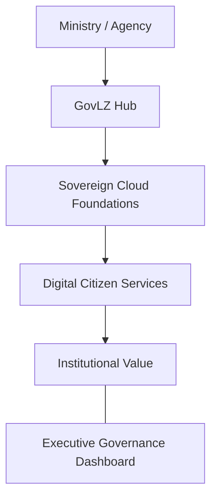

### 2. Detailed Landing Zone Topology
The internal service boundaries and management layers of the industrialized government cloud platform.

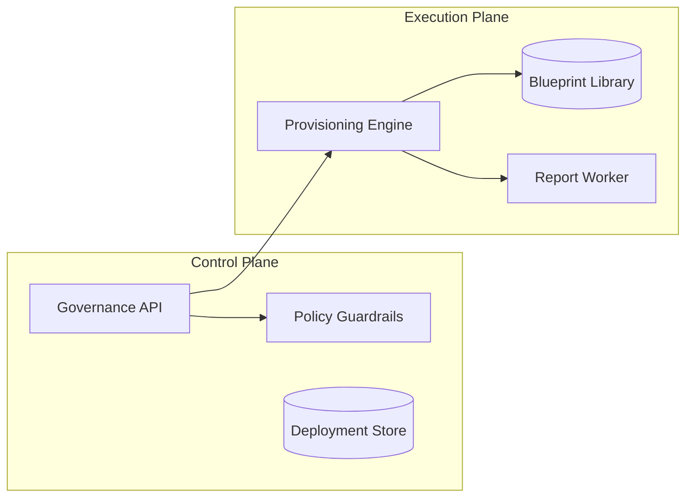

### 3. Citizen Request to Service Response Path
Tracing the path from a citizen's request to a secure, governed service response.

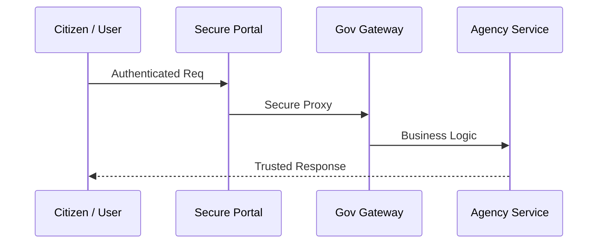

### 4. Control Plane Architecture
The "Brain" of the framework managing global institutional public sector standards and automated validation workflows.

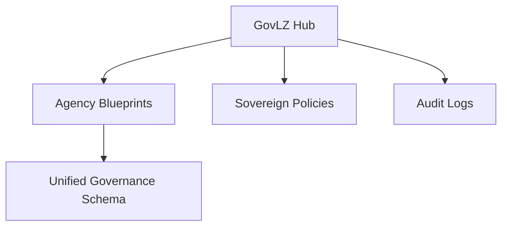

### 5. Multi-Cloud Topology
Synchronizing sovereign foundations across Azure Gov, AWS GovCloud, and GCP Assured Workloads.

```mermaid
graph LR
    Azure[Azure Gov] <-> Bridge[GovLZ Hub] <-> AWS[AWS GovCloud]
    Bridge <-> GCP[GCP Assured]
```

### 6. Regional Deployment Model
Hosting landing zone nodes close to national data centers for localized compliance and high-performance services.

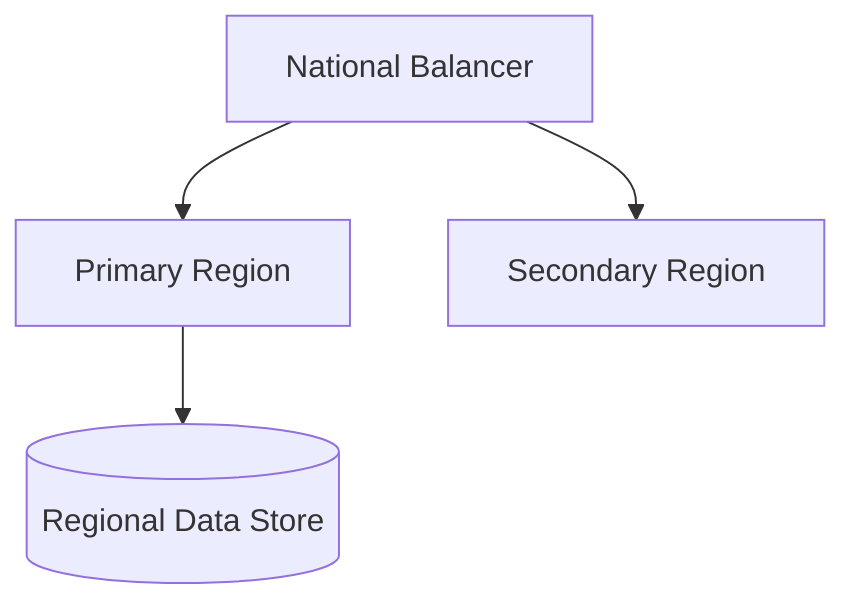

### 7. DR Failover Model
Ensuring platform continuity for critical national infrastructure and citizen services.

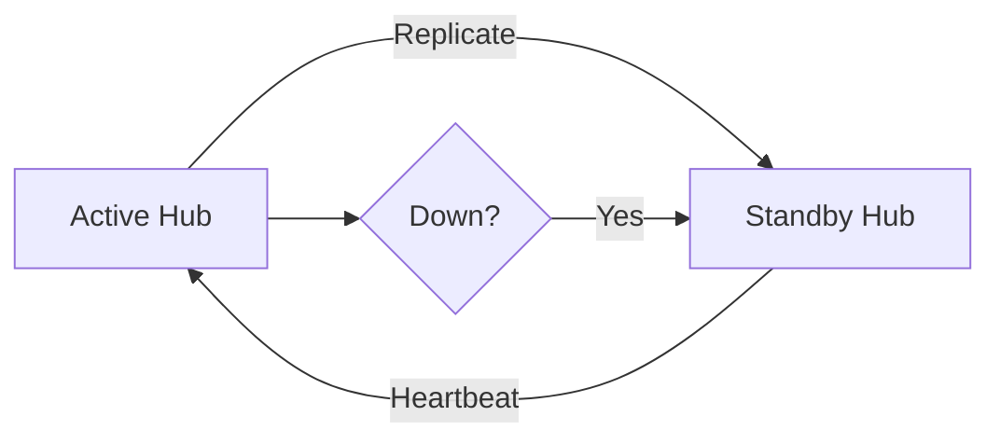

### 8. API Gateway Architecture
Securing and throttling the entry point for governance updates and agency queries.

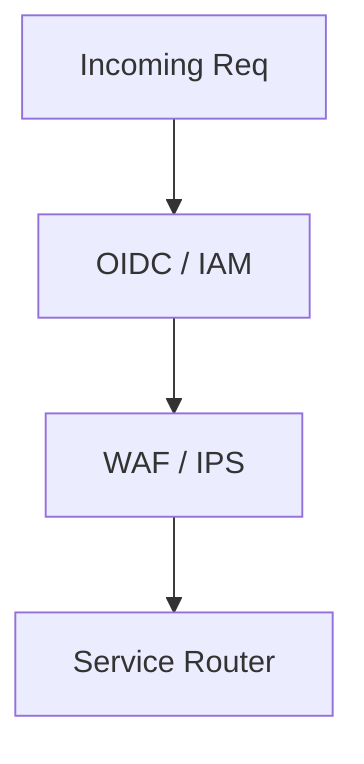

### 9. Queue Worker Architecture
Managing long-running provisioning jobs, mass policy evaluations, and report generations.

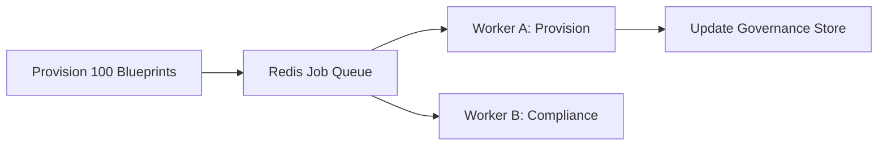

### 10. Dashboard Analytics Flow
How raw governance telemetry becomes executive institutional readiness and cost heatmaps.

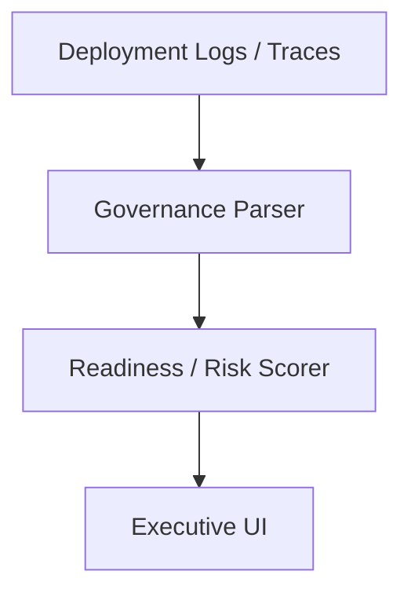

### 11. Management Group Hierarchy
The foundational structure for governing large-scale Azure Government environments with shared policy and access.

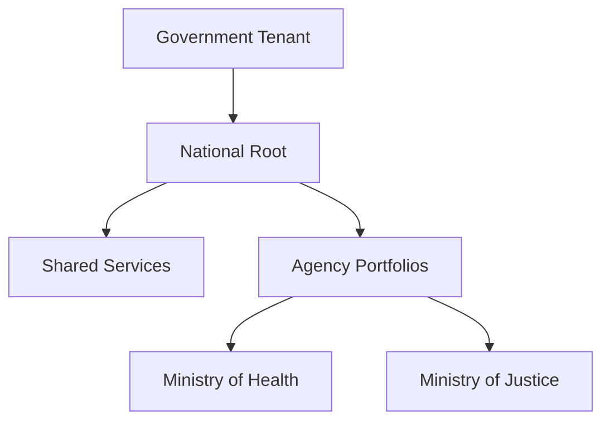

### 12. AWS Organization OU Model
The strategic OU structure for AWS GovCloud to isolate workloads by agency and environment type.

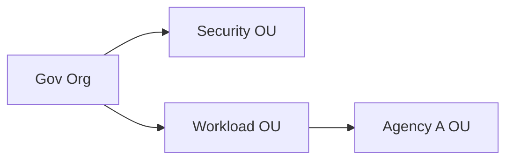

### 13. Agency Segmentation Model
Ensuring logical and physical isolation between different government entities within the shared platform.

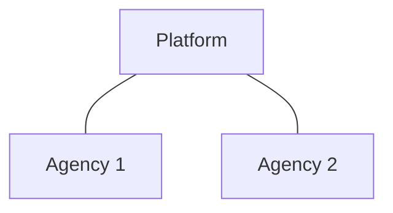

### 14. Shared Services Hub Model
Centralizing common services like DNS, AD, and Security tools to reduce cost and increase consistency.

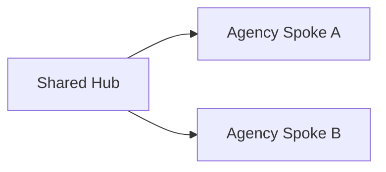

### 15. Hub-Spoke Network Topology
The standard institutional networking pattern for secure and performant agency connectivity.

```mermaid
graph TD
    Hub[National Hub VNET] <-> Spoke1[Health VNET]
    Hub <-> Spoke2[Justice VNET]
```

### 16. Transit Connectivity Workflow
Governing the secure data flow between agencies and external government networks.

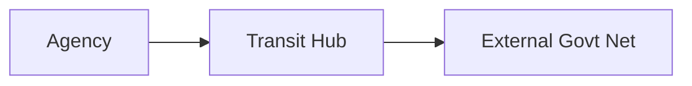

### 17. DNS Architecture
A unified national DNS strategy for resolving internal agency and public citizen service domains.

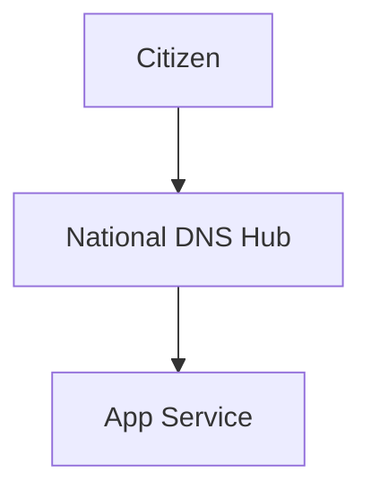

### 18. Identity Trust Boundaries
Defining where agency-specific identities end and national institutional trust begins.

```mermaid
graph LR
    IDP_A[Agency IDP] <-> Fed[National Federation] <-> IDP_B[Agency B]
```

### 19. Environment Separation Model
Strict isolation between Dev, Test, and Prod environments across the entire government landscape.

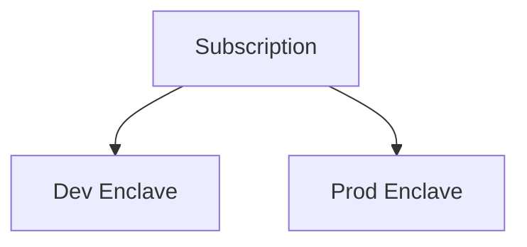

### 20. Sandbox Lifecycle Flow
Managing the automated creation, governance, and decommissioning of ephemeral agency test enclaves.

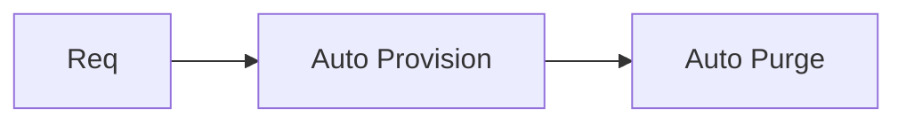

### 21. Citizen Portal Platform Model
The scalable foundation for hosting secure and high-traffic citizen digital portals.

```mermaid
graph TD
    User[Citizen] --> Front[Web Front] --> API[Core API]
```

### 22. Tax System Modernization Flow
Orchestrating the transition of legacy tax systems to the sovereign cloud landing zone.

```mermaid
graph LR
    Legacy[Legacy Tax] --> Mig[Migration Engine] --> GovLZ[GovLZ Platform]
```

### 23. Health Services Platform Model
Ensuring HIPAA-equivalent security for national health record systems and digital clinics.

```mermaid
graph TD
    Doctor[Doctor] --> HealthApp[EMR App] --> VDB[(Health Data)]
```

### 24. Education Platform Model
Providing a secure and performant foundation for national e-learning and student management.

```mermaid
graph LR
    Student[Student] --> LMS[Learning Platform]
```

### 25. Justice System Workflow
Governing the secure handling and audit of legal documents and judicial records.

```mermaid
graph TD
    Case[Case File] --> JusticeApp[Legal Svc] --> Audit[(Immutable Audit)]
```

### 26. Emergency Response Platform
The high-availability architecture for national 911 and disaster response systems.

```mermaid
graph LR
    Event[Incident] --> Alert[Dispatch Svc] --> Ops[Responder]
```

### 27. Smart City Integration Model
Connecting urban IoT sensors and municipal services to the national data foundation.

```mermaid
graph TD
    IoT[Urban Sensor] --> Hub[IoT Hub] --> Analytics[City AI]
```

### 28. Benefits Processing Workflow
Automating the secure intake, validation, and disbursement of national social benefits.

```mermaid
graph LR
    Claim[Citizen Claim] --> Rules[Logic Engine] --> Pay[Payout]
```

### 29. Seasonal Peak Scaling Model
Ensuring platform resilience during peak periods (e.g. tax filing deadlines or national elections).

```mermaid
graph TD
    Load[High Traffic] --> AutoScale[Cluster Scale]
```

### 30. Case Management Lifecycle
Managing the end-to-end lifecycle of citizen case files within the secure landing zone.

```mermaid
graph LR
    Open[Open] --> Process[Process] --> Closed[Archive]
```

### 31. National Data Platform Architecture
The centralized data lake foundation for cross-agency analytics and insights.

```mermaid
graph TD
    Source[Agency Data] --> Lake[National Data Lake] --> Insight[Executive Report]
```

### 32. Fraud Analytics Platform
Utilizing AI to detect and prevent fraud across national benefit and tax systems.

```mermaid
graph LR
    Trans[Transactions] --> AI[Fraud Engine] --> Alert[Investigate]
```

### 33. Public Reporting Pipeline
Automating the publication of open government data while ensuring security and privacy.

```mermaid
graph TD
    Data[Internal Data] --> Redact[Redaction] --> Public[Open Data Portal]
```

### 34. Real-time Event Streaming Model
Ingesting and processing national real-time telemetry (e.g. traffic, weather, grid).

```mermaid
graph LR
    Sensor[Sensor] --> Stream[NATS / Kafka] --> Act[Action]
```

### 35. Regulatory Reporting Workflow
Providing automated evidence for national and international regulatory bodies.

```mermaid
graph TD
    Evidence[Audit Data] --> Report[Regulator PDF]
```

### 36. HPC Research Grid Model
Orchestrating large-scale scientific compute for national labs and universities.

```mermaid
graph LR
    Job[Research Job] --> Grid[HPC Cluster]
```

### 37. AI Citizen Assistant Platform
The governed framework for deploying LLM-powered assistants for citizen queries.

```mermaid
graph TD
    User[Citizen] --> Bot[AI Assistant] --> Policy[Guardrail]
```

### 38. Cross-agency Data Sharing
Securely exchanging data between ministries with full audit and consent management.

```mermaid
graph LR
    AgencyA[A] <-> Exchange[Trust Exchange] <-> AgencyB[B]
```

### 39. Backup Archive Lifecycle
Governing the long-term retention and air-gapped protection of national data.

```mermaid
graph TD
    Active[Hot] --> Archive[Cold] --> AirGap[Vault]
```

### 40. 360 Citizen Services Architecture
Unifying the citizen's journey across multiple ministry portals for a seamless experience.

```mermaid
graph LR
    ID[National ID] --> Profile[Unified Profile] --> Svcs[All Services]
```

### 41. OIDC / SSO Auth Flow
Securing government applications with national identity and MFA.

```mermaid
graph TD
    User[Official] --> NationalID[National ID] --> Portal[App]
```

### 42. RBAC Model
Defining who can manage national foundations, view sensitive data, and deploy agency code.

```mermaid
graph LR
    Role[Auditor] --> View[Read Only]
```

### 43. Privileged Access Workflow
Implementing Just-In-Time (JIT) access for administrative tasks on the national platform.

```mermaid
graph TD
    Req[Access Req] --> Approve[Lead Official] --> Grant[Temp Key]
```

### 44. Secrets Management Flow
How the platform securely stores and rotates API keys and database credentials.

```mermaid
graph LR
    GSS[GovLZ Hub] --> Vault[HSM Vault] --> Secret[API Key]
```

### 45. Classified / Sensitive Zone Model
Enforcing strict physical and logical isolation for classified workloads (e.g. Top Secret).

```mermaid
graph TD
    Public[Zone A] --- Classified[Zone B: AirGapped]
```

### 46. Data Classification Lifecycle
Automatically tagging and protecting data based on its sensitivity level (e.g. Restricted).

```mermaid
graph LR
    Doc[Document] --> Scan[Scanner] --> Tag[Confidential]
```

### 47. Audit Logging Architecture
Capturing every action and data access event across the entire government landscape.

```mermaid
graph TD
    Event[Official Login] --> Log[Immutable SIEM Log]
```

### 48. Vulnerability Remediation Flow
The automated process for identifying and patching vulnerabilities in national apps.

```mermaid
graph LR
    Scan[Vuln Scan] --> Patch[Auto Patch] --> Verify[Pass]
```

### 49. SOC Operations Model
The institutional structure for 24/7 security monitoring and threat hunting.

```mermaid
graph TD
    Alarm[Threat Detect] --> SOC[SOC Team] --> Mitigate[Action]
```

### 50. Incident Response Workflow
The automated sequence for handling national cyber incidents or data breaches.

```mermaid
graph TD
    Breach[Breach Detect] --> IR[IR Team] --> Report[Minister]
```

### 51. Budget Allocation Workflow
Tracing national IT budgets down to specific agencies and programs.

```mermaid
graph LR
    Budget[Annual Budget] --> Allocation[Agency Portfolio]
```

### 52. Chargeback / showback model
Calculating the specific cloud costs incurred by each ministry for financial transparency.

```mermaid
graph TD
    Usage[Usage Data] --> Scorer[Agency Cost] --> Bill[Invoice]
```

### 53. Program Billing Model
Allocating costs to specific multi-agency programs (e.g. Digital Health Initiative).

```mermaid
graph LR
    Svc[Svc A] & Svc2[Svc B] --> Program[Health Project X]
```

### 54. Capacity Planning Workflow
Predicting future national compute and storage requirements based on growth.

```mermaid
graph TD
    Trend[+15% Growth] --> Plan[New Region Setup]
```

### 55. Patch Management Lifecycle
Governing the automated patching of thousands of agency servers and containers.

```mermaid
graph LR
    Update[OS Update] --> Pilot[Agency Pilot] --> Global[Rollout]
```

### 56. Metrics Pipeline
The automated flow for capturing, processing, and storing national performance KPIs.

```mermaid
graph TD
    Agency[Agency Metric] --> Prom[Prometheus] --> Dash[Exec View]
```

### 57. Logging Architecture
The multi-layered approach to capturing logs from every agency to a central sink.

```mermaid
graph LR
    Logs[Agency Logs] --> Sink[National Archive]
```

### 58. Tracing Model
Observing the full end-to-end path of a citizen's request across multiple ministry services.

```mermaid
graph TD
    Citizen[Citizen] --- Health[Health] --- Identity[Identity]
```

### 59. Release Pipeline Governance
Enforcing institutional security and quality gates on all agency software releases.

```mermaid
graph LR
    Commit[Git] --> SecurityGate[Audit] --> Deploy[Prod]
```

### 60. Change Management Workflow
The formal process for approving major architectural changes to the national platform.

```mermaid
graph TD
    Change[Change Req] --> CAB[Change Board] --> Approve[Go]
```

### 61. Executive KPI Review Cycle
Providing the Cabinet with a unified view of national digital readiness and cost.

```mermaid
graph LR
    KPI[Cost/Uptime] --> Minister[Minister Review]
```

### 62. Reliability Scorecard Model
Benchmarking the availability and performance of different agency platforms.

```mermaid
graph TD
    AgencyA[99.99%] <-> AgencyB[95%]
```

### 63. Security Posture Dashboard
Visualizing the real-time compliance and threat landscape across all ministries.

```mermaid
graph LR
    Threats[Active Attacks] --> Dashboard[CISO View]
```

### 64. Agency Benchmark Comparison
Comparing the cloud maturity and efficiency scores of different departments.

```mermaid
graph TD
    Leader[Dept A] <-> Lagging[Dept B]
```

### 65. Sustainability Dashboard Flow
Monitoring the carbon footprint and energy efficiency of national cloud infrastructure.

```mermaid
graph LR
    Watts[Usage] --> Carbon[Metric] --> GreenReport[Sustainability]
```

### 66. Compliance Evidence Workflow
Automatically generating evidence for audits against national security standards.

```mermaid
graph TD
    Logs[Uptime Logs] --> Evidence[Audit PDF]
```

### 67. Quarterly Planning Cadence
The institutional rhythm for planning national digital investments and roadmaps.

```mermaid
graph LR
    Q1[Plan] --> Q2[Execute] --> Q3[Review]
```

### 68. Cabinet Reporting Model
The executive communication path for significant national digital risks and wins.

```mermaid
graph LR
    CTO[CTO] --> Cabinet[Cabinet Meeting]
```

### 69. Public Cloud Maturity Roadmap
The journey from "Basic Lift & Shift" to "Autonomous Citizen Platform."

```mermaid
graph LR
    Crawl[Cloud First] --> Run[Cloud Native]
```

### 70. Continuous Improvement Loop
Evolving national standards based on agency feedback and performance data.

```mermaid
graph TD
    Metric[Latency Data] --> Update[Pattern Update]
```

### 71. Multi-country Cooperation Model
Governing the secure data and service exchange between allied national platforms.

```mermaid
graph LR
    CountryA[A] <-> Protocol[Sovereign Exchange] <-> CountryB[B]
```

### 72. Digital Identity Future State
The roadmap towards decentralized, sovereign, and privacy-preserving national identity.

```mermaid
graph TD
    Classic[User/Pass] --> Future[SSI / Blockchain ID]
```

### 73. AI Assistant Architecture
The secure framework for deploying next-gen AI to assist officials and citizens.

```mermaid
graph LR
    User[Official] --> LLM[Governed AI] --> Data[Gov Knowledge]
```

### 74. Sovereign Cloud Model
Defining the architectures for air-gapped, on-premises, and restricted cloud regions.

```mermaid
graph TD
    Public[Azure] --- Sovereign[Azure Stack Hub]
```

### 75. Cross-border Service Federation
Enabling seamless digital services for citizens traveling between allied nations.

```mermaid
graph LR
    Home[Country A] <-> Verify[Trust Hub] <-> Host[Country B]
```

### 76. Zero Trust Transformation Roadmap
The multi-year mission to eliminate implicit trust across the entire government network.

```mermaid
graph TD
    Phase1[Identity] --> Phase3[Full Zero Trust]
```

### 77. M&A / Agency Merger Workflow
Rapidly integrating and standardizing the IT landscape of merged or new agencies.

```mermaid
graph LR
    NewAgency[New Dept] --> Audit[Governance Scan] --> Hub[Sync]
```

### 78. Smart Nation Roadmap
The long-term vision for a fully integrated, data-driven national digital ecosystem.

```mermaid
graph TD
    Year5[IoT] --> Year15[Autonomous Services]
```

### 79. Innovation Portfolio Roadmap
Planning the next 36 months of national digital platform evolution.

```mermaid
graph LR
    Year1[Assurance] --> Year3[AI Services]
```

### 80. Strategic Transformation Timeline
The executive view of the national journey towards digital sovereignty.

```mermaid
graph TD
    Phase1[Basics] --> Phase3[Full Sovereignty]
```

### 81. Terraform Provisioning Workflow
Automating the creation of the national landing zone infrastructure in the cloud.

```mermaid
graph LR
    Code[TF Code] --> Cloud[Azure Gov]
```

### 82. Drift Detection Model
Automatically identifying and correcting unauthorized changes to the national foundation.

```mermaid
graph TD
    Actual[Cloud State] <-> Desired[Git State] --> Fix[Auto Remediate]
```

### 83. Backup Recovery Model
Governing the protection and testing of historical agency and audit data.

```mermaid
graph LR
    Active[Active] --> Snap[Snap] --> Test[Monthly]
```

### 84. Key Rotation Lifecycle
The automated process for rotating cryptographic keys across national systems.

```mermaid
graph TD
    Key[Current Key] --> Rotate[Auto Gen] --> v2[New Key]
```

### 85. SIEM Integration Flow
Connecting agency logs to the national Security Information and Event Management platform.

```mermaid
graph LR
    Logs[Agency Logs] --> Sentinel[National SIEM]
```

### 86. Vendor Risk Workflow
Auditing and governing the security of third-party software and SaaS used by agencies.

```mermaid
graph TD
    Vendor[SaaS App] --> Audit[Risk Check] --> Approve[Allow]
```

### 87. Queue Processing Lifecycle
Ensuring high-availability for background provisioning and policy sync jobs.

```mermaid
graph TD
    Task[Task] --> Worker[Worker] --> Success[Ack]
```

### 88. Tenant Baseline Comparison
Auditing individual ministry foundations against the national gold-standard baseline.

```mermaid
graph TD
    Gold[National Gold] <-> Agency[Ministry LZ]
```

### 89. Branch office topology
Securing the connectivity between regional government offices and the central cloud hub.

```mermaid
graph LR
    Office[Regional Office] --> VPN[Secure Tunnel] --> Hub[Gov Hub]
```

### 90. DR exercise workflow
Automating the periodic testing of national disaster recovery and failover plans.

```mermaid
graph TD
    Start[DR Test] --> Failover[Trigger] --> Report[Outcome]
```

### 91. Data Retention Governance
Enforcing national legal requirements for data storage durations and purging.

```mermaid
graph LR
    Data[Record] --> Policy[7 Years] --> Purge[Auto Delete]
```

### 92. Citizen Support Model
The institutional path for citizens reporting issues with digital services or data.

```mermaid
graph TD
    Citizen[Citizen] --> Case[Support Case] --> Resolve[Ministry]
```

### 93. Identity Lifecycle Flow
Managing the creation, update, and deactivation of national official identities.

```mermaid
graph LR
    Hire[New Official] --> Provision[ID] --> Retire[Revoke]
```

### 94. Regional Benchmark Comparison
Comparing digital maturity and performance across different provinces or municipalities.

```mermaid
graph TD
    North[95%] --- South[70%]
```

### 95. PMO Operating Model
The institutional structure for governing national digital programs and investments.

```mermaid
graph LR
    Strategy[National PMO] --- Delivery[Agencies]
```

### 96. Secure Enclave model
Designing ultra-secure enclaves for highly sensitive national workloads (e.g. Defense).

```mermaid
graph TD
    Enclave[Secure Enclave] <-> Isolation[Boundary]
```

### 100. Global NOC Operating Model
The institutional structure for 24/7 global national operations and response.

```mermaid
graph LR
    Follow[Follow the Sun] --- Hub[GovLZ Hub]
```

---

## 🔬 Government Cloud Methodology

### 1. The GovLZ Pillars
Our platform is built on four core pillars:
- **Sovereignty**: Enforcing national control over data, identities, and infrastructure.
- **Assurance**: Continuous security and compliance validation against national standards.
- **Efficiency**: Optimizing public sector IT costs and shared services delivery.
- **Service**: Enabling the rapid, secure deployment of world-class citizen digital services.

### 2. Strategic Transformation Framework
We provide a strategic framework for transitioning the nation from "Legacy IT" to "Continuous Sovereign Innovation."

---

## 🚦 Getting Started

### 1. Prerequisites
- **Terraform** (latest version).
- **Azure Government**, **AWS GovCloud**, or **GCP Assured Workloads** credentials.
- **National ID Federation** access (optional).

### 2. Local Setup
```bash
# Clone the repository
git clone https://github.com/Devopstrio/government-lz.git
cd government-lz

# Start the Governance Control Plane
docker-compose up --build
```
Access the Portal at `http://localhost:3000`.

---

## 🛡️ Governance & Security
- **Data Integrity**: Automated verification of foundation provisioning results.
- **Institutional RBAC**: Granular access control for national security configurations.
- **Audit Ready**: Built-in evidence generation for regulatory sovereign cloud audits.

---
<sub>&copy; 2026 Devopstrio &mdash; Engineering the Future of National Digital Sovereignty.</sub>
